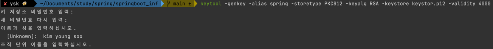
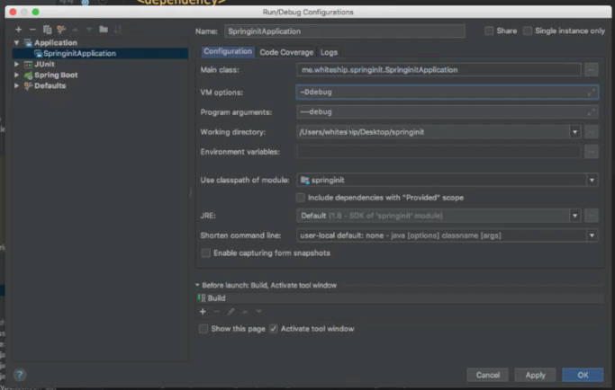
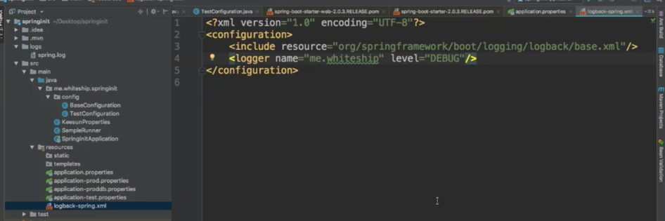

# springboot_inf
스프링부트 개념과 활용_인프런 백기선님


* 스프링 부트 원리
  * 의존성 관리
  * 자동 설정
  * 내장 웹 서버
  *  독립적으로 실행 가능한 JAR
* 스프링 부트 활용
  * 스프링 부트 핵심 기능
    * SpringApplication
    * 외부 설정
    * 로깅
    * 테스트
    * Spring-Boot-Devtools
  * 각종 기술 연동
    * 스프링 웹 MVC
    * 스프링 데이터
    * 스프링 시큐리티
    * REST 클라이언트
* 스프링 부트 운영
  * 엔드포인트
  * 메트릭스
  * 모니터링


섹션 2. 3부 스프링 부트 원리

* 의존성 관리 이해
* 의존성 관리 응용

* 자동 설정 이해

* 자동 설정 만들기 1부: Starter와 AutoConfigure

* 자동 설정 만들기 2부: @ConfigurationProperties

* 내장 웹 서버 이해

* 내장 웹 서버 응용 1부 : 컨테이너와 포트

* 내장 웹 서버 응용 2부 : HTTPS와 HTTP2

* 톰캣 HTTP2

* 독립적으로 실행 가능한 JAR

* 스프링 부트 원리 정리

* 섹션 3. 4부 스프링 부트 활용

* 스프링 부트 활용 소개

* SpringApplication 1부

* SpringApplication 2부

* 외부 설정 1부

* 외부 설정 2부 (1)

* 외부 설정 2부 (2)

* 프로파일

* 로깅 1부: 스프링 부트 기본 로거 설정

* 로깅 2부: 커스터마이징

* 테스트

* 테스트 유틸

* Spring-Boot-Devtools

* 스프링 웹 MVC 1부: 소개

* 스프링 웹 MVC 2부: HttpMessageConverters

* 스프링 웹 MVC 3부: ViewResolve

* 스프링 웹 MVC 4부: 정적 리소스 지원

* 스프링 웹 MVC 5부: 웹JAR

* 스프링 웹 MVC 6부: index 페이지와 파비콘

* 스프링 웹 MVC 7부: Thymeleaf

* 스프링 웹 MVC 8부: HtmlUnit

* 스프링 웹 MVC 9부: ExceptionHandler

* 스프링 웹 MVC 10부: Spring HATEOAS

* 스프링 웹 MVC 11부: CORS

* 스프링 데이터 1부: 소개

* 스프링 데이터 2부: 인메모리 데이터베이스

* 스프링 데이터 3부: MySQL

* 스프링 데이터 4부: PostgreSQL

* 스프링 데이터 5부: 스프링 데이터 JPA 소개

* 스프링 데이터 6부: 스프링 데이터 JPA 연동

* 스프링 데이터 7부: 데이터베이스 초기화

* 스프링 데이터 8부: 데이터베이스 마이그레이션

* 스프링 데이터 9부: Redis

* 스프링 데이터 10부: MongoDB

* 스프링 데이터 11부: Neo4j

* 스프링 데이터 12부: 정리

* 스프링 시큐리티 1부: Starter-Security

* 스프링 시큐리티 2부: 시큐리티 설정 커스터마이징

* 스프링 REST 클라이언트 1부: RestTemplate과 WebClient

* 스프링 REST 클라이언트 2부: 커스터마이징

* 그밖에 다양한 기술 연동

* 섹션 4. 5부 스프링 부트 운영

* 스프링 부트 Actuator 1부: 소개

* 스프링 부트 Actuator 2부: JMX와 HTTP

* 스프링 부트 Actuator 3부: 스프링 부트 어드민

* 섹션 5. 6부 마무리

* 강의 마무리

# 스프링 부트 소개 

* https://docs.spring.io/spring-boot/docs/current/reference/htmlsingle/#getting-started-introduci
ng-spring-boot

* 제품 수준의 스프링 기반 애플리케이션을 만들 때 빠르고 쉽게 만들 수 있다.

* 근본적으로 빠르고 광범위하게 액세스할 수 있는 시작 환경을 제공합니다.

* 일일히 설정을 하지 않아도 이미 컨벤션으로 정해져 있는 설정을 제공, 그러나 원하는데로 요구 사항에 따라 기본 설정들을 쉽고 빠르게 바꿀 수 있다. 

* 대규모 클래스에 공통적인 다양한 기능 외 기능 제공프로젝트 수(예: 임베디드 서버, 보안, 메트릭, 상태 확인 및 외부화 구성).

* 코드 생성이 전혀 없고 XML 구성이 필요하지 않습니다.

# 자동 설정 이해
* @EnableAutoConfiguration (@SpringBootApplication 안에 숨어 있음)
* 빈은 사실 두 단계로 나눠서 읽힘
  *  1단계: @ComponentScan
  *  2단계: @EnableAutoConfiguration
    1. 컴포넌트 스캔으로 빈을 등록하고, 
    2. EnableAutoConfiguration으로 읽어온 빈을 다시 등록한다. 
    * 즉 2번 빈을 등록하는것.  

* @ComponentScan 에서 읽는 빈들 아래 어노테이션이 달린 애들을 가져와 빈으로 등록
  *  @Component
  * @Configuration @Repository @Service @Controller @RestController
    * ComponentScan가 달려있는 클래스의 패키지부터 하위패키지 모두로 쭉 위 어노테이션들이 달린 클래스들을 빈으로 등록. 

* @EnableAutoConfiguration 에서 읽는 빈들 아래 어노테이션이 달린 애들을 가져와 빈으로 등록  
  * spring.factories
    *  org.springframework.boot.autoconfigure.EnableAutoConfiguration

  *  @Configuration
  * @ConditionalOnXxxYyyZzz


> External Libraries -> org.springframework.boot:spring-boot-autoconfigure -> spring.factories 파일에 적힌 애들이 기본설정된 애들이다. 


# 자동 설정 만들기 1부: Starter와 Autoconfigure
* https://docs.spring.io/spring-boot/docs/current/reference/htmlsingle/#boot-features-developing-auto-configuration

* Xxx-Spring-Boot-Autoconfigure 모듈: 자동 설정
* Xxx-Spring-Boot-Starter 모듈: 필요한 의존성 정의
* 그냥 하나로 만들고 싶을 때는?
  * Xxx-Spring-Boot-Starter
* 구현 방법
1. 의존성 추가
```xml
dependencies>
<dependency>
  <groupId>org.springframework.boot</groupId>
  <artifactId>spring-boot-autoconfigure</artifactId>
</dependency>
<dependency>
<groupId>org.springframework.boot</groupId>
<artifactId>spring-boot-autoconfigure-processor</artifactId>
<optional>true</optional>
</dependency>
        </dependencies>
<dependencyManagement>
<dependencies>
  <dependency>
    <groupId>org.springframework.boot</groupId>
    <artifactId>spring-boot-dependencies</artifactId>
    <version>2.0.3.RELEASE</version>
    <type>pom</type>
    <scope>import</scope>
  </dependency>
</dependencies>
</dependencyManagement>
```

2. @Configuration 파일 작성
```java
@Configuration
public class HoloManConfiguration {

    @Bean
    public HoloMan holoMan() {
        HoloMan holoMan = new HoloMan();
        holoMan.setHowLong(5);
        holoMan.setName("youngsoo");

        return holoMan;
    }
}
```

3. src/main/resource/META-INF에 spring.factories 파일 만들기

4. spring.factories 안에 자동 설정 파일 추가
  * org.springframework.boot.autoconfigure.EnableAutoConfiguration=\ 패키지명.Configuration파일
    * org.springframework.boot.autoconfigure.EnableAutoConfiguration=\
  com.ys.springboot.HoloManConfiguration


5. maven install
  * 다른 프로젝트에서 사용할 수 있게 빌드를 하고 install 해야한다 (다운로드 말고 )
  * 인텔리제이 오른쪽 상단 Maven -> Lifecycle -> install 
  * 또는 콘솔에서 mvn install 

> 이러면 이 프로젝트를 빌드를 해서 jar 파일 생성된걸 다른 메이븐 프로젝트에서도 사용할 수 있도록 로컬 메이븐 저장소에 설치를 한다  

6. 그러면 다른 프로젝트에서 pom.xml에 이 프로젝트를 불러와 쓸 수 있다.
  * ```xml
    <dependencies>
      <groupId>com.ys</groupId>
	    <artifactId>springboot</artifactId>
    </dependencies>
    ```
  
  * 이러면 다른 프로젝트에서 만든 빈을 가져와 쓸 수 있다
    * 그러나 현재 프로젝트에서 같은 빈을 만들어도 다른 프로젝트의 빈이 먼저가 된다. 
    * `덮어쓰기 라고 한다`
 
# 자동 설정 만들기 2부: @ConfigurationProperties
*  덮어쓰기 방지하기
  * @ConditionalOnMissingBean
  * > 위에서 만든 프로젝트인 com.ys.springboot 프로젝트 (빈을 사용하는 프로젝트 말고 빈을 만든 프로젝트)
      의 @Bean을 등록하는 곳에서 @ConditionalOnMissingBean 어노테이션을 붙인다.  
    * 그러면 불러오는 프로젝트에서 같은 타입의 빈이없으면 그럴때만 이 bean을 등록하라는 의미가 된다.  
    * ```java      
      @Configuration
      public class HoloManConfiguration {

          @Bean
          @ConditionalOnMissingBean // << 불러오는 프로젝트에서 HoloMan타입의 빈이 없을땐 이 빈이 된다. 
          public HoloMan holoMan() {
              HoloMan holoMan = new HoloMan();
              holoMan.setHowLong(5);
              holoMan.setName("youngsoo");

              return holoMan;
          }
      }
      ```
* 빈 재정의 수고 덜기
  * @ConfigurationProperties(“holoman”)
  * @EnableConfigurationProperties(HolomanProperties)
  * 프로퍼티 키값 자동 완성  


* ## 프로퍼티 파일에서 프로퍼티 값을 불러와서 사용하는 방법. 
  * 키 값 자동 완성! 


* 의존성 꼭 추가 
```xml
<dependency>
<groupId>org.springframework.boot</groupId>
<artifactId>spring-boot-configuration-processor</artifactId>
<optional>true</optional>
</dependency>
```

1. properties 클래스 생성
```java
@Getter @Setter
@ConfigurationProperties("holoman")
public class HolomanProperties {

    private String name;

    private int howLong;
}

```
2. appcation.properties 파일에 프로퍼티 작성
```xml
holoman.name = 졸려요.
holoman.how-long = 100
```
3. 빈에 적용
```java

@Configuration
@EnableConfigurationProperties(HolomanProperties.class)
public class HoloManConfiguration {

    @Bean
    @ConditionalOnMissingBean
    public HoloMan holoMan(HolomanProperties properties) {
        HoloMan holoMan = new HoloMan();
        holoMan.setHowLong(properties.getHowLong());
        holoMan.setName(properties.getName());

        return holoMan;
    }
}

```

# 내장 웹 서버 이해
*  스프링 부트는 서버가 아니다.
  * 톰캣 객체 생성
  * 포트 설정
  * 톰캣에 컨텍스트 추가
  * 서블릿 만들기
  * ○ 톰캣에 서블릿 추가
  * ○ 컨텍스트에 서블릿 맵핑
  * ○ 톰캣 실행 및 대기
* 이 모든 과정을 보다 상세히 또 유연하고 설정하고 실행해주는게 바로 스프링부트의 자동 설정.
  *  ServletWebServerFactoryAutoConfiguration (서블릿 웹 서버 생성)
    * TomcatServletWebServerFactoryCustomizer (서버 커스터마이징)
  * DispatcherServletAutoConfiguration
    * 서블릿 만들고 등록

## 스프링부트가 내장 웹서버 실행시키는 코드

* 이런 방식으로 스프링부트 내에서 돌아간다 .

```java
public static void main(String[] args) throws LifecycleException {
//		SpringApplication.run(SpringbootApplication.class, args);

		Tomcat tomcat = new Tomcat();
		tomcat.setPort(8080);

		Context context = tomcat.addContext("/", "/");


		HttpServlet httpServlet = new HttpServlet() {
			@Override
			protected void doGet(HttpServletRequest req, HttpServletResponse resp) throws ServletException, IOException {

				PrintWriter writer = resp.getWriter();

				writer.println("<html><head><title>");
				writer.println("Hey, Tomcat");
				writer.println("</title></head>");
				writer.println("<body><h1>Hello Tomcat</h1></body>");
				writer.println("</html>");
			}
		};

		String servletName = "helloServlet";
		tomcat.addServlet("/", servletName, httpServlet);
		context.addServletMappingDecoded("/hello", servletName);


		tomcat.start();

		tomcat.getServer().await();

	}
```

# 내장 웹 서버 응용 1부: 컨테이너와 서버 포트
* https://docs.spring.io/spring-boot/docs/current/reference/html/howto-embedded-web-servers.html

* 다른 서블릿 컨테이너로 변경
* 웹 서버 사용 하지 않기
* 포트
  * server.port
  * 랜덤 포트
  * ApplicationListener<ServletWebServerInitializedEvent>

```java

@Component
public class PortListener implements ApplicationListener<ServletWebServerInitializedEvent> {
    @Override
    public void onApplicationEvent(ServletWebServerInitializedEvent servletWebServerInitializedEvent) {
        ServletWebServerApplicationContext applicationContext = servletWebServerInitializedEvent.getApplicationContext();
        System.out.println(applicationContext.getWebServer().getPort());
    }
}
```

# 내장 웹 서버 응용 2부: HTTPS와 HTTP2, SSL 세팅 

* https://opentutorials.org/course/228/4894
* https://gist.github.com/keesun/f93f0b83d7232137283450e08a53c4fd

* HTTPS 설정하기
  * 키스토어 만들기
  * HTTP는 못쓰네?
* HTTP 커넥터는 코딩으로 설정하기
  * https://github.com/spring-projects/spring-boot/tree/v2.0.3.RELEASE/spring-boot-samples/spring-boot-sample-tomcat-multi-connectors
* HTTP2 설정
  * server.http2.enable
  * 사용하는 서블릿 컨테이너 마다 다름


## HTTPS
* HTTPS를 만들라면 키스토어가 필요하다 
* 쉘 로 키스토어를 받고, properties 설정을 해줘야 한다. 
* 
* 쉘 명령어
  * ```shell
    keytool -genkey 
    -alias tomcat 
    -storetype PKCS12 
    -keyalg RSA 
    -keysize 2048 
    -keystore keystore.p12 
    -validity 4000    
    ```
    * 

* properties 설정 
```properties
server.ssl.key-store: keystore.p12
server.ssl.key-store-password: 123456
server.ssl.keyStoreType: PKCS12
server.ssl.keyAlias: spring // -alias 옵션에 넣은것 
```

* 이러면 모든 요청은 https으로 요청해야한다. 
  * 이러면 http는 못쓴다. 

* https, http 둘다 쓰려면 ???

> HTTP 커넥터(연결해주는)는 하나인데,HTTPS 설정을 해버리면 HTTP 요청을 받을 수 없다.  
새로운 커넥터를 코딩으로 설정해서 HTTP 요청을 총 2개의 커넥터로 HTTP 요청도 받을 수 있다.

* `커넥터를 만들어 주면 된다`
  * 이러면 포트번호는 다르지만, http, https 둘 다 받을 수 있다. 

```java
@SpringBootApplication
public class SpringbootApplication {

	public static void main(String[] args) throws LifecycleException {
		SpringApplication.run(SpringbootApplication.class, args);
	}

	@Bean
	public ServletWebServerFactory serverFactory() {
		TomcatServletWebServerFactory tomcatFactory = new TomcatServletWebServerFactory();
		tomcatFactory.addAdditionalTomcatConnectors(createStandardConnect());
		return tomcatFactory;
	}

	private Connector createStandardConnect() {
		Connector connector = new Connector("org.apache.coyote.http11.Http11NioProtocol");
		connector.setPort(8090); // properties에서 설정한 원래 포트번호와 다르게 설정
		
		return connector;
	}
}
```

## https 설정
* properties 파일에서 설정
```properties
server.http2.enabled=true 
```

* 또는 spring-boot-starter-undertow 추가

* 아니면 톰캣과 자바버전을 다르게 ! 
  * 톰캣 HTTP2
  * JDK9와 Tomcat 9+ 추천
  *  그 이하는 아래 링크 참고
  * https://docs.spring.io/spring-boot/docs/current/reference/html/howto-embedded-web-servers.html#howto-configure-http2-tomcat

# 독립적으로 실행 가능한 JAR
* https://docs.spring.io/spring-boot/docs/current/reference/html/executable-jar.html
“그러고 보니 JAR 파일 하나로 실행할 수 있네?”
* mvn package를 하면 실행 가능한 JAR 파일 “하나가" 생성 됨.
* spring-maven-plugin이 해주는 일 (패키징)
* 과거 “uber”는 jar 를 사용
  * 모든 클래스 (의존성 및 애플리케이션)를 하나로 압축하는 방법
  * 뭐가 어디에서 온건지 알 수가 없음
    * 무슨 라이브러리를 쓰는건지..
  * 내용은 다르지만 이름이 같은 파일은 또 어떻게?
  * 스프링 부트의 전략
    * 내장 JAR : 기본적으로 자바에는 내장 JAR를 로딩하는 표준적인 방법이 없음.

* 자바에는 jar안에 있는 jar파일을 읽을 수 있는 표준적인 방법이 없다. 
  * 애플리케이션 클래스와 라이브러리 위치 구분
  * org.springframework.boot.loader.jar.JarFile을 사용해서 내장 JAR를 읽는다.
  * org.springframework.boot.loader.Launcher를 사용해서 실행한다.
  * war, properties 런처도 있다. 


> 모든 의존성 및 라이브러리(jar파일들)도 하나의 jar로 합친다. 

* 의존성 관리
  * springboot-starter 가 의존성 관리 
    * pom.xml 의 <parent></parent> 를 타고 올라가다 보면 springboot Dependencies가 있다 여기서 다 관리해준다 
  * 이것만 넣어도 이만큼이나 다 알아서 가져오네?

* 자동 설정
  * @EnableAutoConfiguration이 뭘 해주는지 알겠어.
* 내장 웹 서버
  * 아 스프링 부트가 서버가 아니라 내장 서버를 실행하는 거군.
* 독립적으로 실행 가능한 JAR
  * spring-boot-maven 플러그인이 이런걸 해주는구나..


# 스프링 부트 활용
### 3부에서는 스프링 부트가 제공하는 여러 기능을 사용하며 원하는대로 커스터마이징 하는 방법을 학습합니다.


# 스프링 부트 활용 소개


|스프링 부트 핵심 기능| 각종 기술 연동|
|---|---|
|● SpringApplication | ● 스프링 웹 MVC
|● 외부 설정 | ● 스프링 데이터
|● 프로파일 | ● 스프링 시큐리티
|● 로깅 | ● REST API 클라이언트
|● 테스트 | ● 다루지 않은 내용들
|● Spring-Dev-Tools |


# SpringApplication

* https://docs.spring.io/spring-boot/docs/current/reference/html/boot-features-spring-application.html#boot-features-application-events-and-listeners
* ApplicationEvent 등록
  * ApplicationContext를 `만들기 전에 사용하는 리스너`는 @Bean으로 등록할 수 없다.
    * 빈으로 등록해도 리스너가 동작을 하지 않는다. ApllicationContext가 만들어지기 전이기 때문에 
    * 이런경우엔 직접 등록을 해줘야 한다 어떻게? 
      * SpringApplication.addListeners()
      * ```java
        @SpringBootApplication
        public class SpringbootApplication {

        public static void main(String[] args) throws LifecycleException {

          SpringApplication springApplication = new SpringApplication(SpringApplication.class);
          springApplication.addListeners(new SampleListener());
          springApplication.run(args);
          }

        }

        ```

* WebApplicationType 설정
* 애플리케이션 아규먼트 사용하기
  * ApplicationArguments를 빈으로 등록해 주니까 가져다 쓰면 됨.
* 애플리케이션 실행한 뒤 뭔가 실행하고 싶을 때
  * ApplicationRunner (추천) 또는 CommandLineRunner
  * 순서 지정 가능 @Order

# 21. 외부 설정 1부 (스프링 부트 외부 설정)

https://docs.spring.io/spring-boot/docs/current/reference/htmlsingle/#boot-features-external-config
사용할 수 있는 외부 설정
* properties
* YAML
* 환경 변수
* 커맨드 라인 아규먼트

## application.properties
* key-value 형태로 값을 정의하여 참조하여 사용 가능 

```properties
youngsoo.name = youngsoo
...
```

```java
@Component
public class SampleRunner implements ApplicationRunner {
    
  @Value("${youngsoo.name}")
  private String name;
}
```
### test에서 application.properties 참조하기
* import org.springframework.core.env.Environment;
```java
@SpringBootTest
class SpringbootApplicationTests {

    @Autowired
    Environment environment;

    @Test
    void contextLoads() {
        assertThat(environment.getProperty("youngsoo.name"))
                .isEqualTo("youngsoo");
    }

}
```
* 테스트  resources 아래의 properties가 기본 properties에 덮어씌워 테스트 properties가 쓰
  * 기본 application.properties < test_resources_application.properties  
* 테스트 코드 실행시 빌드 순서
  1. main.java 아래의 소스 빌드 후 target - classes로 들어감
  2. test.java 아래의 소스 빌드 후 target - classes로 들어감. 
 


프로퍼티 우선 순위
1. 유저 홈 디렉토리에 있는 spring-boot-dev-tools.properties
2. 테스트에 있는 @TestPropertySource
   * @TestPropertySource(properties = "youngsoo.name=youngsoo1")
   * @TestPropertySource(location = "classpath:/test.properties")
     * test/resources/test.properties를 만들어야 불러와서 사용한. 
3. @SpringBootTest 애노테이션의 properties 애트리뷰트
   * @SpringBootTest(properties = "youngsoo.name=youngsoo2")
4. 커맨드 라인 아규먼트
   * java -jar target/springinit-SNAPSHOT.jar --youngsoo.name=youngsoo (jar 파일에 옵션줌)
5. SPRING_APPLICATION_JSON (환경 변수 또는 시스템 프로티) 에 들어있는
   프로퍼티
6. ServletConfig 파라미터
7. ServletContext 파라미터
8. java:comp/env JNDI 애트리뷰트
9. System.getProperties() 자바 시스템 프로퍼티
10. OS 환경 변수
11. RandomValuePropertySource
12. JAR 밖에 있는 특정 프로파일용 application properties
13. JAR 안에 있는 특정 프로파일용 application properties
14. JAR 밖에 있는 application properties
15. JAR 안에 있는 application properties
16. @PropertySource
17. 기본 프로퍼티 (SpringApplication.setDefaultProperties)

* ### application.properties 우선 순위 (높은게 낮은걸 덮어 씁니다.)
1. file:./config/
2. file:./
3. classpath:/config/
4. classpath:/

* 랜덤값 설정하기
   * ${random.*}
   * `프로퍼티 재사용 (플레이스 홀더)`
   * ```properties
     youngsoo.name = youngsoo
     youngsoo.fullname = ${youngsoo.name} kim
     ```
   * name = youngsoo
   * fullName = ${name} kim

# 외부 설정 2부
* 다음 의존성 추가 후 빌드
* ```xml
  <dependency>
      <groupId>org.springframework.boot</groupId>
      <artifactId>spring-boot-configuration-processor</artifactId>
  </dependency>
  ```
* 프로퍼티 클래스 작성

```java
@Getter @Setter
@Component
@ConfigurationProperties("youngsoo")
public class YoungsooProperties {
    private String name;
    private int age;
    private String fullName;
}
```

* @EnableConfigurationProperties 설정
```java
@SpringBootApplication
@EnableConfigurationProperties(YoungsooProperties.class)
public class SpringbootApplication {
}
```

* 이러면 YoungsooProperties 인스턴스를 빈으로 주입받아 사용 가능


타입-세이프 프로퍼티 @ConfigurationProperties
  * 여러 프로퍼티를 묶어서 읽어올 수 있음
  * 빈으로 등록해서 다른 빈에 주입할 수 있음
    * @EnableConfigurationProperties
    * @Component
    * @Bean
  * 융통성 있는 바인딩(클래스 내의 필드이름에 바인 )
    * context-path (케밥)
    * context_path (언드스코어)
    * contextPath (캐멀)
    * CONTEXTPATH   
  * 프로퍼티 타입 컨버전
    * @DurationUnit
  * 프로퍼티 값 검증
    * @Validated 사용
    * JSR-303 (@NotNull, ...) 을 지원한다. 
  * 메타 정보 생성
  * @Value
    * SpEL 을 사용할 수 있지만...
    * 위에 있는 기능들은 전부 사용 못합니다

# 프로파일 (profile) 설정 

@Profile 애노테이션은 어디에?
* @Configuration
* @Component

어떤 프로파일을 활성화 할 것인가?
* spring.profiles.active
  * application-properties 파일 안에 profile 이름 설정
    * ex) spring.profiles.active=prod 

어떤 프로파일을 추가할 것인가?
* spring.profiles.include

프로파일용 프로퍼티
* application-{profile}.properties

```java
@Profile("prod") // application.properties 내에 spring.profiles.active=prod 설정 해야 작동 
@Configuration
public class BaseConfiguration {

    @Bean
    public String hello() {
        return "hello";
    }
}
```

# 로깅 1부: 스프링 부트 기본 로거 설정
로깅 퍼사드 VS 로거
* Commons Logging, SLF4j - 실제 로깅을 하는 애들이 아니고 로거 api들을 추상화 해놓은 인터페이스 
* JUL, Log4J2, `Logback` - 이 로거 구현체들을 바꿔 낄 수 있따.


`스프링 5에 로거 관련 변경 사항`
* https://docs.spring.io/spring/docs/5.0.0.RC3/spring-framework-reference/overview.html#overview-logging
* Spring-JCL 모듈
  * Commons Logging -> SLF4j or Log4j2로 변경 가능
  * pom.xml에 exclusion 안해도 됨.


스프링 부트 로깅
* 기본 포맷
* --debug (일부 핵심 라이브러리만 디버깅 모드로)
* --trace (전부 다 디버깅 모드로)
* application.properties 에서 설정  
  * 컬러 출력: spring.output.ansi.enabled
  * 파일 출력: logging.file 또는 logging.path
  * 로그 레벨 조정: logging.level.패지키 = 로그 레벨


### 더 많은 로그를 보고싶다면?
* 
  * 다음처럼 옵션을 주면 된다.  둘중에 하나.

# 로깅 2부: 커스터마이징
* https://docs.spring.io/spring-boot/docs/current/reference/html/howto-logging.html

커스텀 로그 설정 파일 사용하기

* Logback: logback-spring.xml
  * 다음과 같이 설정
  * 
* Log4J2: log4j2-spring.xml
* JUL (비추): logging.properties
* Logback extension
  * 프로파일 <springProfile name=”프로파일”>
  *  Environment 프로퍼티 <springProperty>
로거를 Log4j2로 변경하기
* https://docs.spring.io/spring-boot/docs/current/reference/html/howto-logging.html#howto-configure-log4j-for-logging

